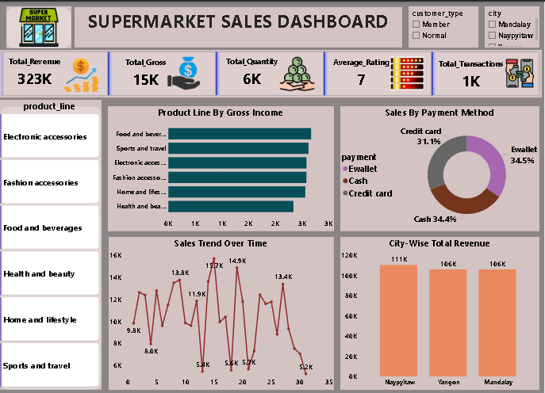

# 🛒 Supermarket Sales Analysis

## 📌 Project Overview
This project performs **Exploratory Data Analysis (EDA)** and **SQL-based insights** on a supermarket sales dataset, followed by the creation of a **Power BI Dashboard** 
to visualize key metrics.

The goal is to uncover **sales trends**, **customer preferences**, and **revenue patterns** to support business decision-making.

## 📂 Project Structure
├── Dashboard_Screenshot.PNG # Screenshot of the Power BI dashboard

├── Supermarket_Sales_EDA.html # Jupyter Notebook exported as HTML (EDA results)

├── Supermarket_sales_query.sql # SQL queries used for analysis

└── README.md # Project documentation

## 📊 Dashboard Overview

**Key Metrics Displayed:**
- **Total Revenue:** 323K  
- **Total Gross Income:** 15K  
- **Total Quantity Sold:** 6K  
- **Average Rating:** 7  
- **Total Transactions:** 1K  

**Visual Insights:**
1. **Product Line by Gross Income** – Top contributors: Food & Beverages, Sports & Travel.
2. **Sales by Payment Method** – Balanced split between Ewallet (34.5%), Cash (34.4%), and Credit Card (31.1%).
3. **Sales Trend Over Time** – Shows fluctuations and peak sales dates.
4. **City-wise Total Revenue** – Naypyitaw (111K), Yangon (106K), Mandalay (106K).

## 🛠️ Tools & Technologies Used
- **SQL** – Data extraction and analysis  
- **Python (Pandas, Matplotlib, Seaborn)** – EDA and data visualization  
- **Power BI** – Dashboard creation  
- **Jupyter Notebook** – For analysis workflow documentation  

---

## 📜 SQL Analysis Queries
The `Supermarket_sales_query.sql` file contains **15 analytical queries**, including:

1. **City with the highest total revenue**
2. **Most frequently purchased product line**
3. **Average customer rating per city**
4. **Transactions per payment method**
5. **Gross income per product line**
6. **Top contributing customer type**
7. **Highest revenue day**
8. **Average unit price per product line**
9. **Highest average gross income per transaction**
10. **Sales variation by weekday**
11. **Average transaction value per customer type**
12. **Low-rated but high-revenue product lines**
13. **Top 3 grossing product lines per city**
14. **High quantity but low profit margin products**
15. **Revenue contribution by product line per city**

## 🔍 EDA Highlights
From the **`Supermarket_Sales_EDA.html`** report:
- **Top Revenue Cities:** Naypyitaw > Yangon ≈ Mandalay  
- **Best Performing Category:** Food and Beverages  
- **Customer Ratings:** Fairly balanced across cities, average ~7/10  
- **Payment Mode Usage:** Evenly split across three payment methods  
- **Sales Trends:** Peaks mid-month, indicating possible payday effect

## 📈 Key Business Insights
- **Ewallet** slightly outperforms other payment methods, indicating a trend toward digital payments.  
- **Food and Beverages** dominates revenue share, suggesting potential for targeted promotions.  
- **Mid-month sales peaks** can inform marketing campaigns for maximum impact.  
- **Certain product lines** have high sales volume but low margins — opportunities for pricing strategy adjustments.  .

